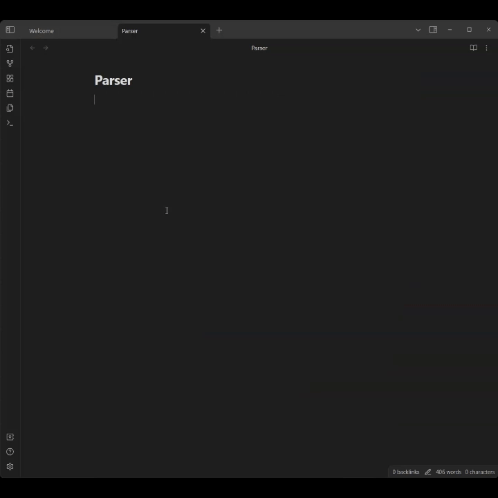

# Obsidian Gemini-Generator 

Generate notes with the help of [Google Gemini](https://gemini.google.com/app?hl=de).

# (Planned)Features
Currently this plugin offers only one command, to generate the note based on the notes title. 

However, the following features are **planned:**
- Use a custom prompt template
- Generate notes with a custom prompt
- Automatic formatting of the response

# Setup
After installing the plugin, you need an Api-Key.
To get one, you need a Google Account. Then create an API-key at the [Google AI Studio](https://aistudio.google.com/app/apikey). Depending on your region you might need to add a [payment method](https://ai.google.dev/gemini-api/terms#use-restrictions) to you Google cloud account.

With that done, head to the settings tab for Gemini Generator and paste your Api Key.

Now you can use the `Generate Note` command to let Gemini generate the note.

# Privacy
This plugin uses the Gemini-Api from google to generate the notes. Thus, for every note that one generates, the title of the note is sent as a http request against the API.
If this is a concern for you, this plugin may not be the best choice for you.